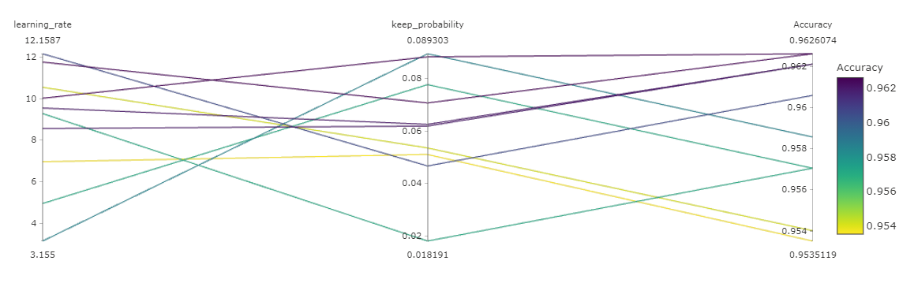
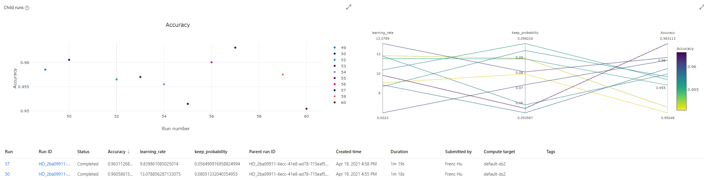

# Potentially Deadly Mushroom Classification

# Table of Contents
1. [Project Set Up and Installation](#setup)
2. [Dataset](#data)
	1. [Overview](#overview)
	2. [Task](#task)
	3. [Access](#access)
3. [Automated ML](#automl)
	1. [Results](#automl-results)
4. [Hyperparameter Tuning](#hyper)
	1. [Results](#hyper-results)
5. [Model Deployment](#deploy)
6. [Screencast](#screencast)
7. [Standout Suggestions](#standout)

This dataset is called the Mushroom Classification dataset from Kaggle, source: https://www.kaggle.com/uciml/mushroom-classification.  
The goal of this project is to be able to accurately identify poisonous and edible mushrooms based on the features and qualities provided. I will 
be using both AutoML and SKLearn+Hyperdrive to determine which method will produce a model with the highest accuracy.

"This dataset includes descriptions of hypothetical samples corresponding to 23 species of gilled mushrooms in the Agaricus and Lepiota Family 
Mushroom drawn from The Audubon Society Field Guide to North American Mushrooms (1981). Each species is identified as definitely edible, 
definitely poisonous, or of unknown edibility and not recommended. This latter class was combined with the poisonous one. The Guide clearly states 
that there is no simple rule for determining the edibility of a mushroom; no rule like "leaflets three, let it be'' for Poisonous Oak and Ivy." 

## Project Set Up and Installation <a name="setup" />
My project has no special installation steps. I ran it on my personal AzureML account on my local machine. The notebooks are written so it can be 
run on any valid AzureML subscription.  
I did find it easier to upload the dataset directly to Azure but as is showcased in my Hyperdrive training script, I can also pull the data 
directly from my github.

## Dataset <a name="data" />

### Overview <a name="overview" />
This dataset was obtained from Kaggle and it was donated to UCI ML in 1987. Although the dataset is over 30 years old, it has been updated in the 
last 5 years and is still a great real-life example of a classification problem.
The dataset contains 23 different features as follows and the goal is to predict the class:

classes: edible=e, poisonous=p  
cap-shape: bell=b,conical=c,convex=x,flat=f, knobbed=k,sunken=s  
cap-surface: fibrous=f,grooves=g,scaly=y,smooth=s  
cap-color: brown=n,buff=b,cinnamon=c,gray=g,green=r,pink=p,purple=u,red=e,white=w,yellow=y  
bruises: bruises=t,no=f  
odor: almond=a,anise=l,creosote=c,fishy=y,foul=f,musty=m,none=n,pungent=p,spicy=s  
gill-attachment: attached=a,descending=d,free=f,notched=n  
gill-spacing: close=c,crowded=w,distant=d  
gill-size: broad=b,narrow=n  
gill-color: black=k,brown=n,buff=b,chocolate=h,gray=g, green=r,orange=o,pink=p,purple=u,red=e,white=w,yellow=y  
stalk-shape: enlarging=e,tapering=t  
stalk-root: bulbous=b,club=c,cup=u,equal=e,rhizomorphs=z,rooted=r,missing=?  
stalk-surface-above-ring: fibrous=f,scaly=y,silky=k,smooth=s  
stalk-surface-below-ring: fibrous=f,scaly=y,silky=k,smooth=s  
stalk-color-above-ring: brown=n,buff=b,cinnamon=c,gray=g,orange=o,pink=p,red=e,white=w,yellow=y  
stalk-color-below-ring: brown=n,buff=b,cinnamon=c,gray=g,orange=o,pink=p,red=e,white=w,yellow=y  
veil-type: partial=p,universal=u  
veil-color: brown=n,orange=o,white=w,yellow=y  
ring-number: none=n,one=o,two=t  
ring-type: cobwebby=c,evanescent=e,flaring=f,large=l,none=n,pendant=p,sheathing=s,zone=z  
spore-print-color: black=k,brown=n,buff=b,chocolate=h,green=r,orange=o,purple=u,white=w,yellow=y  
population: abundant=a,clustered=c,numerous=n,scattered=s,several=v,solitary=y  
habitat: grasses=g,leaves=l,meadows=m,paths=p,urban=u,waste=w,woods=d  

### Task <a name="task" />
I will be attempting to determine if a mushroom is poisonous or edible based on the attributes listed above. I decided to use all the features 
given except veil-color and gill attachment because they have the same value for all rows.
I was not sure which features will contribute the most to the determination of poisonous or edible so I initially trained my model with all the 
features and then retrained it without veil color and gill attachment to see if it would make any difference.
Ultimately I decided, based on the results that it was ok to remove those features. They had very low importance in my runs.
The original dataset file also had t and f as values for some of the features so I made sure to convert those to booleans to give those features 
the proper representation.

### Access <a name="access" />
I used Dataset.Tabular.from_delimited_files to access this dataset in my workspace. I uploaded the dataset to my github and then proceeded to use 
the URL for the raw .csv data as my datapath.
You will see in my Hyperdrive training script that I pull the data directly from my github and utilize it for the hyperparameter tuning run.

## Automated ML <a name="automl" />
My AutoML settings are as follows: 
automl_settings = {
                    "experiment_timeout_hours" : 0.5,
                    "enable_early_stopping" : True,
                    "iteration_timeout_minutes": 5,
                    "max_concurrent_iterations": 2,
                    "max_cores_per_iteration": -1,
                    "featurization": 'auto',
                    "verbosity": logging.INFO,
                }
I chose these settings at first because they were the default configuration settings for the first project and they seemed reasonable for this 
project as well. I was fully prepared to change or tweak the settings as needed if I wasn't getting the results I wanted but these settings ended 
up working pretty well.
Experiment timeout was sufficient because the runs usually took between 15-20 minutes.  
Enable early stopping is true because if I hit a point where my metric goals were met, I wanted to be able to conserve resources and end the run 
early.  
Iteration timeout was reasonable as well because most of my iterations took less than a minute and if it timed out, it would have been a very 
clear indication that I had a problem somewhere.  
Max concurrent iterations and max cores per iteration were derived from the compute instance I was using which only had two cores.  
Featurization was set to auto because I wasn't entirely clear which features were more important than others. I also did not have a sparse amount 
of data so featurization was possible.

Since I did two runs, one with One Hot Encoding and one with Label Encoding, my AutoMLConfig was slightly different for the two runs but mainly 
just in 
detemining which dataframes were used.  
The task was always classification, the primary metric was always accuracy, the number of cross validations was always 5 and I always tried to 
enable onxx_compatible_models.  
This is a classification task because I am trying to determine if a mushroom is either poisonous or edible and accuracy is a good primary metric 
because you want correct predictions from the model.

### Results <a name="automl-results" />
The best accuracy model from my One Hot encoded run was MaxAbsScaler, LightGBM with an accuracy of 100%!  
Feature importance had odor_n being the most important by far with a weight of 3.8 while the next most important feature was stalk_root_c with a 
weight of 0.6.

The best accuracy model from my Label Encoded run was VotingEnsemble with an accuracy of 100%. The MaxAbsScaler, LightGBM model only gave an 
accuracy of 0.99988 for the label encoded dataset.  
The ensembled algorithms were ['LightGBM', 'LightGBM', 'LightGBM', 'LightGBM', 'LightGBM'] with weights of  [0.3333333333333333, 
0.16666666666666666, 0.16666666666666666, 0.16666666666666666, 0.16666666666666666]. This meant that the results of 5 different LightGBM 
iterations were ensembled together to produce the final result of 100% accuracy!  
Feature importance for this run had gill-color at the highest importance with a weight of 1.3 followed by spore-print-color at 0.6 and population 
at 0.43. This showed me that both types of encoding would get me to an accuracy of 100% but the features and weights that comprised those models 
were very different. 
 
One Hot Encoded Feature Importance

	 
Label Encoded Feature Importance

It is interesting to note that before I removed veil-color and gill-attachment from the data, odor was the feature with the highest importance for 
the label encoded run as well with an accuracy of 100% but once those features were removed, it changed to gill color. I'm not quite sure why this 
is but if I had more time, I would explore this phenomenon.
As I have reached 100% accuracy with my automl run, the best way to improve on this project is to obtain more data and see if my model still holds 
up. Just because it was able to predict with 100% accuracy on the data available does not mean that it is failproof or it can accurately predict 
whether or not mushrooms with different combinations of qualities are edible or poisonous. More data is needed to properly ascertain the accuracy 
and effectiveness of this model. I would also explore what would happen if I removed / added more features / attributes of the mushrooms because 
even removing a couple changed the results of my models.

I ultimately decided to go with the Label Encoded run as my best model because it weighted the features more evenly while still producing results 
of 100% accuracy.

Run Details

Best Model

## Hyperparameter Tuning <a name="hyper" />
For this project I chose the logistic regression model because I label encoded my data and then scaled it using StandardScaler which gave me 
continuous values for a lot of my features. I considered using One-Hot Encoding and using a KNN model as well but upon seeing the results of the 
AutoML run, I decided that I should stick with label encoding so I could properly compare my results and I decided to use logistic regression 
because I was curious to see how well it would perform.

For this project, I started with a lot of the default hyperdrive configuration settings as the first project.
I decided to start somewhere familiar and then if I wasn't getting the results I was expecting or I was getting results I wasn't satisfied with, I 
would tweak the parameters and configuration settings as I went but I discovered that a lot of the settings from the first project worked well 
for this one as well.  
I used BanditPolicy (terminates runs where the primary metric is smaller than (Metric + Metric*Slack_Factor)) as my early termination method 
because it allows for early termination of low performance runs. I chose it over the other two options because it is the most aggressive about 
saving money and as I was on a personal Azure account, I didn't want to run up a large bill. Budget aside, I had no issues obtaining satisfying 
results with BanditPolicy so I decided to not change it.  
I used Random Parameter Sampling because it supports early termination of low performance runs and it was the best choice of my options because I 
wasn't doing a lot of runs which Bayesian sampling needs (ideally 20+). I also wanted to sweep over a range of continuous hyperparameter values so 
grid sampling was out because it only supports discrete hyperparameter values.  
The ranges I chose for my hyperparameters (learning rate and keep probability) started out as the same as the previous projects but then I did 
runs with the ranges both higher and lower in order to see what kind of impact it had on my results. In both cases, I got lower accuracy when I 
tweaked the ranges so I kept learning rate at normal(10,3) which is a range centered around 10 with a standard deviation of 3 and I kept the keep 
probability at uniform(0.05,0.1).  
I tried values of normal(15,2), normal(8,3) and normal(5,3) to see if I would get better results with a higher or lower range 
of values but accuracy was slightly lower for those runs than at normal(10,3). I also tried values of uniform(0.01,0.1), uniform(0.01,0.15), 
uniform(0.05, 0.15) 
for keep probability but they also returned slightly lower accuracy than the default value.

### Results <a name="hyper-results" />
The results of my hyperdrive model gave me an accuracy of 0.963 with a learning rate of 9.83986 and a keep probability of 0.05649. The results of 
the other runs with higher and lower learning rate and keep probabilities produced models with accuracies of 0.962 at their best but the parameter 
ranges of normal(10,3) and uniform(0.05,0.1) for learning rate and keep probability respectively just edged out the other ranges.  In the following 
screenshots, you can see the different parameter ranges I tried and which ones produced the best model.

{"learning_rate":["normal",[10,3]],"keep_probability":["uniform",[0.05,0.1]]}

{"learning_rate":["normal",[11,3]],"keep_probability":["uniform",[0.01,0.15]]}

	 
{"learning_rate":["normal",[8,3]],"keep_probability":["uniform",[0.01,0.09]]}

I could have improved this model by exploring even more combinations of ranges and maybe narrowing down the ranges once I knew the general 
vicinity of the best values. Maybe these parameter values are local maxes and 100% accuracy is achievable with logistic regression but the ranges 
are something completely different. This hyperdrive run really just gave me the starting point and if I were to refine this project in the future, 
I would continue looking for the best hyperparameters to maximize accuracy.

Run Details

Best Model

## Model Deployment <a name="deploy" />
I took my AutoML Label encoded model and reigstered it to AzureML so it would be available for deployment. I then deployed that model via 
ACIWebService with the bare minimum for cpu cores and memory because this model will most likely not be utilized heavily or in such a manner that 
requires more resources considering it needs to be deleted for this project.

In order to query my endpoint with a sample input, you first need to convert your input fields from strings to ints.  
The conversion method is to match up the string inputs from the dataset with label encoded values from this list:
class ['e' 'p']  
cap-shape ['b' 'c' 'f' 'k' 's' 'x']  
cap-surface ['f' 'g' 's' 'y']  
cap-color ['b' 'c' 'e' 'g' 'n' 'p' 'r' 'u' 'w' 'y']  
bruises [False  True]  
odor ['a' 'c' 'f' 'l' 'm' 'n' 'p' 's' 'y']  
gill-spacing ['c' 'w']  
gill-size ['b' 'n']  
gill-color ['b' 'e' 'g' 'h' 'k' 'n' 'o' 'p' 'r' 'u' 'w' 'y']  
stalk-shape ['e' 't']  
stalk-root ['?' 'b' 'c' 'e' 'r']  
stalk-surface-above-ring ['f' 'k' 's' 'y']  
stalk-surface-below-ring ['f' 'k' 's' 'y']  
stalk-color-above-ring ['b' 'c' 'e' 'g' 'n' 'o' 'p' 'w' 'y']  
stalk-color-below-ring ['b' 'c' 'e' 'g' 'n' 'o' 'p' 'w' 'y']  
veil-color ['n' 'o' 'w' 'y']  
ring-number ['n' 'o' 't']  
ring-type ['e' 'f' 'l' 'n' 'p']  
spore-print-color ['b' 'h' 'k' 'n' 'o' 'r' 'u' 'w' 'y']  
population ['a' 'c' 'n' 's' 'v' 'y']  
habitat ['d' 'g' 'l' 'm' 'p' 'u' 'w']  

For example, if you wanted to have an input with cap shape b and habitat g, you would use the index of the value in its list as its int 
representation so cap shape would become 0 and habitat would be 1 because of their respective positions in their respective lists.
Once you have the payload in json format, you can then ping the endpoint with a POST request containing the aci service scoring URI and the data 
with appropriate headers.
Example:  
resp = requests.post(aci_service.scoring_uri, json_data, headers=headers)

predicted_values = json.loads(json.loads(resp.text))['result']

Another way of testing the endpoint with input data is to go to the deployed endpoints tab in AzureML Studio and under test, you can manually 
input the values you want to test. I will showcase this method in the screencast as well. Under the consume tab, it also gives you code on how to 
query the endpoint with a JSON payload.

Model Endpoint Healthy and Deployed

## Screen Recording <a name="screencast" />
Screencast Link: https://youtu.be/ILG3TDsDJ4k

## Standout Suggestions <a name="standout" />
I tried to make my model onxx compatible but I was unable to make it work. This is an issue I've run into this entire course. On the documentation 
for AutoML Settings, it has enable_onxx_compatible_models as a valid parameter but when I tried to use it in practice, it kept throwing warnings 
that the parameter was not recognized. I'm believe the documentation might be out of date or maybe the interaction has changed.